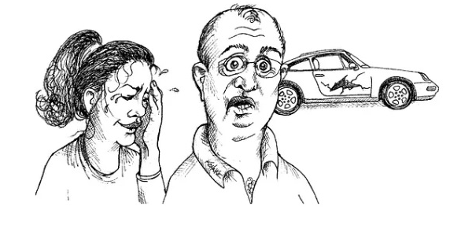

- You have to think about given image and come with scenarios.
- What are the try and catches are occurring into that image.
 
- You have to find different kind of exceptions. You have to write them in code with proper sequence.